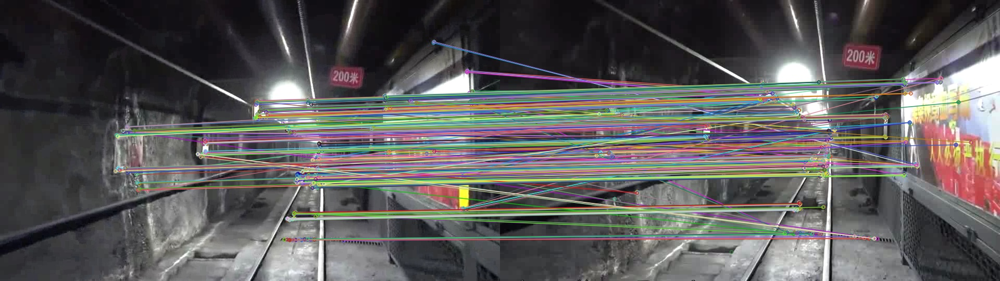
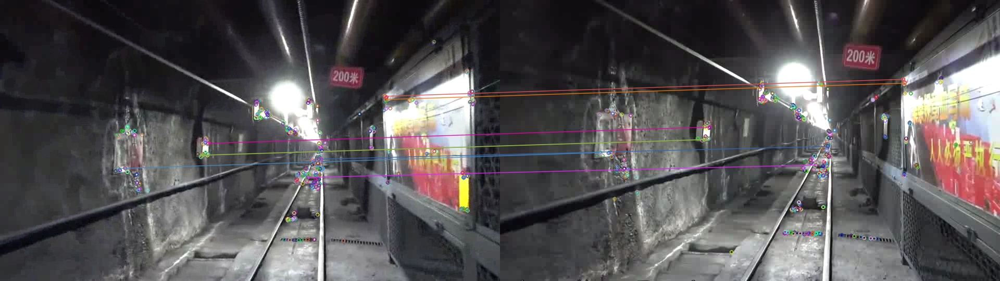
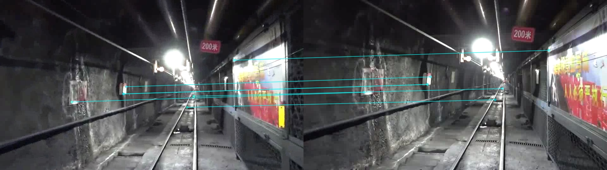

# Image-feature-test
This a code for image_dataset feature extracting and matching test
##  usage
```
mkdir build
cd build
cmake ..
make
./feature_compare
```

## use your own dataset
- put your images(make_pair) in the /dataset file
- change the test.txt like this format: "Pic_name1 Pic_name2\n"

## change feature extracting&matching function
```
#define GFTT_ 0
#define ORB_ 1
#define SURF_ 2
#define SIFT_ 3
#define BF_ "BruteForce-Hamming"
#define FL_ "FlannBased"
Feature_compare test(ORB_,BF_);
```

## result.txt format
after running the program,you can get some result images and a result.txt in the result file.
- result.txt format: result<<matches.size()<<Timecost<<repeatability<<correspCount<<endl;
```
example:
7 36.3307 0.714286 5
fail!
36 20.9461 0.777778 28
7 25.3972 1 7
fail!
39 22.7996 0.615385 24
fail!
7 28.2962 1 7
7 26.3875 1 7
30 21.5593 0.9 27

```
## result image show
- step1:all matching

- step2:after pick

- step3:after ransac


